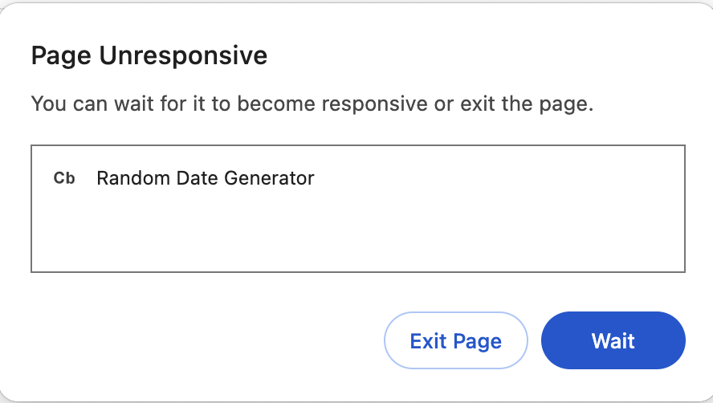
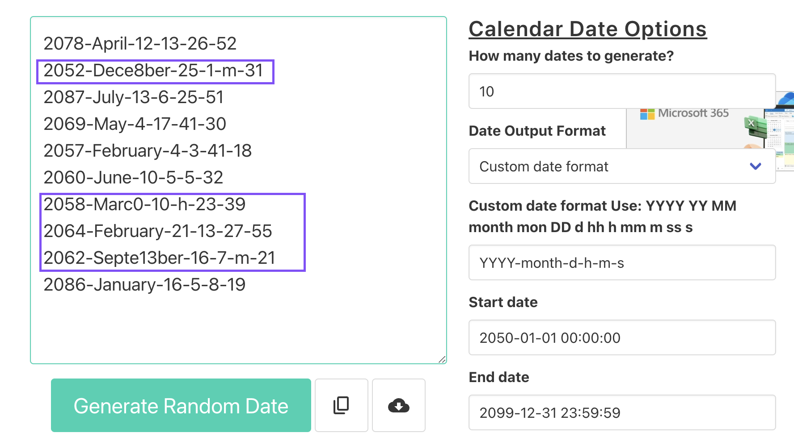

# Random Date Generator - Test Report

### Feature: https://codebeautify.org/generate-random-date

## Textbox for "How many dates to generate?" question:

1. **Input Validation:**
    - *Observation:* The textbox currently allows input of negative numbers or non-integers.
    - *Recommendation:* Implement input validation, permitting only integers greater than or equal to 1.

2. **Character Restriction:**
    - *Observation:* The textbox accepts non-numeric characters, such as the letter 'e.'
    - *Recommendation:* Implement character restrictions to disallow any non-numeric input for a more robust user experience.

3. **Input Limitation:**
    - *Observation:* Entering a very large number, such as 1000000, every time causes the page to crash.
    - *Recommendation:* Consider implementing an upper limit for the number of dates to be generated to enhance stability and prevent system overload.

4. **Found a Bug:**
   
   - *Steps to Reproduce:* Enter the number 1000000 in the textbox for "How many dates to generate".
   - *Issue:* Memory or stack overflow issue, exceeding available system resources and causing a program crash.
   - *Solution:* Optimize the code for large data or restrict input ranges to prevent such issues.

  

  

## Textboxes for Start date and End date:

1. **Date Sequence Validation:**
    - *Observation:* The end date can be set earlier than the start date, resulting in the generator treating the end date as the start date and vice versa.
    - *Recommendation:* Add validation to ensure that the end date is set after the start date, providing a more intuitive user experience.

2. **Date Entry Structure:**
    - *Observation:* The current implementation uses a single textbox for both start date and end date, which is not an ideal structure. It could cause non-date formats.
    - *Recommendation:* Implement distinct textboxes for each date component or utilize a date selector can enhance user input accuracy and minimize the risk of entering incorrect date formats.

## Custom date format Use:

1. **Clarity of the Description:**
   - *Observation:* The current description of the custom date format is not clear, potentially causing confusion.
   - *Recommendation:* Enhance the clarity of the custom date format usage by providing explicit descriptions.

2. **Custom Date Format:**
   - *Observation:* The current implementation uses a single textbox, which could lead to the display of a bug when entering an incorrect date format.
   - *Recommendation:* Implement distinct textboxes for each date component to enhance user input accuracy and minimize the risk of entering incorrect date formats.

3. **Found a Bug:**

   - *Steps to Reproduce:* Enter the custom date format 'YYYY-month-d-h-m-s' into the designated textbox.
   - *Issue:* Data format or code issue.
   - *Solution:* Implement distinct textboxes for each date component and add character restrictions to prevent an unrecognizable date format.

  

  

